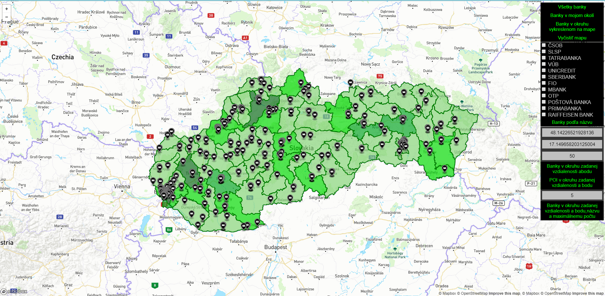
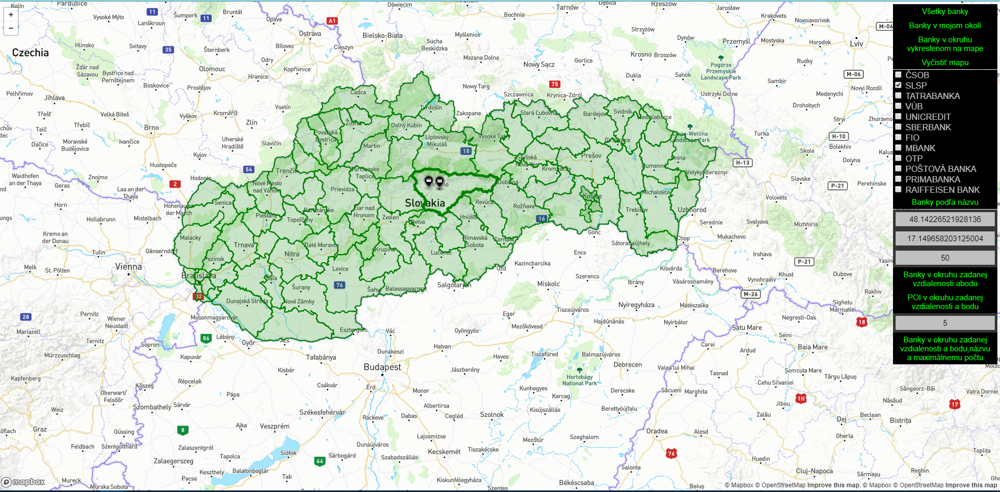
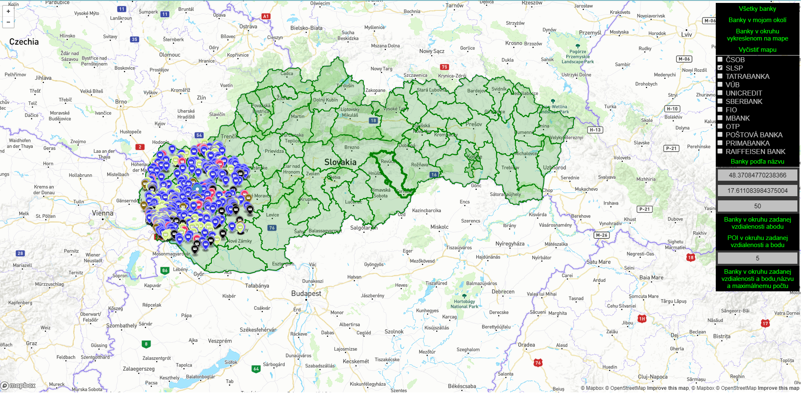

## Overview

Aplikácia je schopná zobrazovať na mape banky na Slovensku. Po spustení aplikácie sú používateľovi automaticky zobrazené všetky banky na Slovensku spolu s heat mapou, ktorá znázorňuje úroveň kriminality na Slovensku. Hlavnú funkcionalitu aplikácie tvoria tieto akcie:

- lokalizovanie používateľa cez webový prehliadač a zobrazenie najbližších bánk v okruhu 20km
- filtrovanie bánk podľa názvu banky
- filtrovanie bánk podľa určeného bodu na mape a zvoleného okruhu v km
- nájdenie bankomatov a bodov záujmu (reštaurácie, bary, verejné toalety, kaviarne) podľa určeného bodu na mape a zvoleného okruhu v km
- nájdenie najbližších bánk (počet si zvolí používateľ) od zvoleného bodu na mape, zvoleného okruhu v km a zvolených názvov bánk
- vyhľadanie bánk v okresy, na ktorý si používateľ vie kliknúť na mape

- bol použitý vlastný štýl background mapy vytvorený pomocou platformy Mapbox
- body záujmu sú od seba aj bánk farebne odlíšené
- heat mapa kriminality
- označené hranice okresov a ich zvýrazňovanie po prejdení myšou nad ním


## Screenshots

* Po spustení aplikácie:


* Banky vo vybranom okrese:


* Body záujmu vo vybranej oblasti:



## Frontend

Frontend aplikácie tvorí statické html, ktoré je súcasťou backendovej webovej aplikácie v podobe welcome page. Celý frontend sa skladá z troch časťí: `map.html`, ktorý tvorí view, kde sú zobrazené všetky komponenty stránky. Ďalej `script.js`, kde je celá biznis logika frontendu. Sú tu funkcie, ktoré sa starajú o komunikáciu so serverom prostredníctvom API volaní a funkcie ktoré vykreslujú prvky do mapy. O ovládanie mapy sa stará javascript `mapbox.js`, ktorý je importovaný do našej stránky a o ovládanie API sa stará `jquery.min.js` Posledný súbor je `menu.css`, kde je zadefinovaný vzhľad zobrazovanej stránky.

Prevažnú časť našej stránky tvorí mapa, ktorá je po spustení zväčšená a vycentrovaná na Slovensko. Na pravej strane máme vertikálne menu s ovládacími prvkami aplikácie. Celá aplikácia je ladená do jednoduchých farieb - čierna, biela, zelená.


## Backend

Backend aplikácie je vytvorený v programovacom jazyku java. Skladá sa z troch tried. Trieda `Dbs.java` sa stará o pripojenie k lokálnej databáze, o vykonávanie jednotlivých queries na základe API volania z frontendu a následnému vytvoreniu geojsona odoslanému späť na frontend. V triede `RESTController.java` sa odchytávajú jednotlivé API volania, parsujú parametre ktoré prídu z frontendu a odosielajú triede `Dbs.java` na spracovanie. Trieda `Application.java` slúži len ako štartovacia trieda webovej aplikácie.


## Api

### Request

**Nájde všetky bánky na Slovensku**

`GET http://localhost:8080/allBanks`

**Vykreslenie heatmapy úrovne kriminality na Slovensku**

`GET http://localhost:8080/getBoundaries`

**Nájde banky v mojom okolí**

`GET http://localhost:8080/nearestBanks?zs=48.689045199999995&zd=17.0126196&radius=20`

**Nájdenie bánk podľa názvu**

`GET http://localhost:8080/choosedBanks?cb_csob=true&cb_slsp=true&cb_tb=false&cb_vub=true&cb_unicredit=false&cb_sberbank=false&cb_fio=false&cb_mbank=false&cb_otp=false&cb_postova=false&cb_prima=false&cb_raiffeisen=false`

**Nájdenie bodov záujmu**

`GET http://localhost:8080/nearestAtms?zs=48.29050321714062&zd=20.159912109375004&radius=50`

**Nájdenie bánk podľa názvu, zvoleného bodu a limitu**

`GET http://localhost:8080/nearestBanksInRadiusAndName?zs=48.29050321714062&zd=20.159912109375004&radius=50&count=5&cb_csob=true&cb_slsp=true&cb_tb=false&cb_vub=true&cb_unicredit=false&cb_sberbank=false&cb_fio=false&cb_mbank=false&cb_otp=false&cb_postova=false&cb_prima=false&cb_raiffeisen=false`

**Vykreslenie bánk zo zvoleného okresu**

`GET http://localhost:8080/getBanksOfBoudary?boundary=okres_Bratislava_III`

**Vykreslenie heatmapy úrovne kriminality na Slovensku**

`GET http://localhost:8080/getBoundaries`

### Response

```JSON
{  
	"geometry":{  
		"coordinates":[  
			17.0195292,
			48.4362554998319  
		],  
		"type":"Point"  
	},  
	"type":"Feature",  
	"properties":{  
		"marker-symbol":"bank",  
		"city":"city",  
		"street":"Radlinského",  
		"streetnumber":"65",  
		"postcode":"85101",  
		"marker-color":"#000000",  
		"title":"SLOVENSKA SPORITELNA",  
		"marker-size":"small"  
	}  
}
```


## Data

* https://www.openstreetmap.org - informácie o bankách a bodoch záujmu získavame priamo z OSM dát (názvy, adresy, geopozíciu...). Takisto aj dáta o hraniciach okresoch získavame z OSM. Dáta sme naimportovali do našej databáza pomocou nástroja `osm2pgsql`. V databáze sme použili defaultnú schému stĺpcov OSM.

* https://portal.minv.sk - informácie o kriminalite sme získali zo štatistík Ministerstva vnútra SR. Štatistiky boli rozdelené poďla okresov a použili sme informácie o zistených trestných činoch v jednotlivých okresoch. V databáze sme vytvorili nasledujúcu tabuľku:

```SQL
CREATE TABLE public.kriminalita_okresy
(
    id integer NOT NULL,
    name character varying(150) COLLATE pg_catalog."default",
    tc_zistene integer,
    tc_objasnene integer,
    tc_percent real,
    okres character varying(150) COLLATE pg_catalog."default",
    CONSTRAINT kriminalita_okresy_pkey PRIMARY KEY (id)
)
```


## Optimalization

* Vytvorenie tabuľky bánk z tabuľky planet_osm_point s hotovými geojsonami, názvami a pozíciami + vytvorenie indexu nad názvami bánk

```SQL
CREATE TABLE banky_point AS (SELECT ST_AsGeoJSON(ST_Transform(way, 4326)) AS result, name, tags, way FROM planet_osm_point 
	WHERE amenity LIKE 'bank' 
	AND name IS NOT NULL
ORDER BY name)	

CREATE INDEX name_point_idx ON banky_point (name);
```

* Vytvorenie tabuľky bánk z tabuľky planet_osm_polygon s hotovými geojsonami, názvami a pozíciami + vytvorenie indexu nad názvami bánk

```SQL
CREATE TABLE banky_polygon AS (SELECT ST_AsGeoJSON(ST_Transform(way, 4326)) AS result, name, tags, way FROM planet_osm_point 
	WHERE amenity LIKE 'bank' 
	AND name IS NOT NULL
ORDER BY name)	

CREATE INDEX name_poly_idx ON banky_polygon (name);
```

* Vytvorenie tabuľky bodov záujmu z tabuľky planet_osm_point s hotovými geojsonami, názvami a pozíciami + vytvorenie indexu nad amenity bodov záujmu

```SQL
CREATE TABLE point_of_interest AS (SELECT ST_AsGeoJSON(ST_Transform(way, 4326)) AS result, operator, amenity, way FROM planet_osm_point 
	WHERE (amenity LIKE 'atm' OR amenity LIKE 'bar' OR amenity LIKE 'cafe' OR amenity LIKE 'restaurant' OR amenity LIKE 'toilets')
ORDER BY amenity)
	
CREATE INDEX amenity_poi_idx ON point_of_interest (amenity);
```

* Vytvorenie tabuľky okresov z tabuľky planet_osm_polygon s hotovými geojsonami, názvami a pozíciami

```SQL
CREATE TABLE svk_okresy AS (SELECT ST_AsGeoJSON(ST_Transform(way, 4326)) AS result, planet_osm_polygon.name, planet_osm_polygon.way FROM planet_osm_polygon 
	WHERE planet_osm_polygon.boundary LIKE 'administrative' 
	AND planet_osm_polygon.admin_level LIKE '8'
	AND planet_osm_polygon.name LIKE 'okres%'
ORDER BY name)
```

* Konsolidácia dát pre všetky banky - aby sa nepoužívali v query funkcie v podmienke WHERE UPPER(unaccent(name))

```SQL
UPDATE banky_point
SET name = UPPER(unaccent(name))
where UPPER(unaccent(name)) like UPPER(unaccent('ČSOB%'))
```
